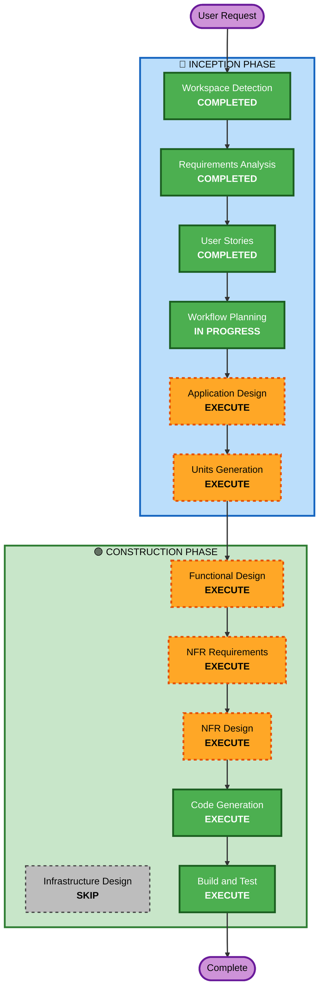

# Execution Plan

## Detailed Analysis Summary

### Change Impact Assessment
- **User-facing changes**: Yes — 고객 주문 UI, 관리자 대시보드 UI 신규 구축
- **Structural changes**: Yes — 전체 시스템 신규 설계 (Frontend + Backend + DB)
- **Data model changes**: Yes — 매장, 테이블, 메뉴, 주문, 주문이력 등 신규 데이터 모델
- **API changes**: Yes — REST API + SSE 엔드포인트 신규 설계
- **NFR impact**: Yes — 실시간 통신(SSE), 세션 관리, 인증

### Risk Assessment
- **Risk Level**: Medium — 신규 프로젝트이지만 복잡한 실시간 통신과 세션 관리 포함
- **Rollback Complexity**: Easy — Greenfield, 기존 시스템 영향 없음
- **Testing Complexity**: Moderate — SSE 실시간 통신, 세션 라이프사이클 테스트 필요

## Workflow Visualization



### Text Alternative
```
Phase 1: INCEPTION
  - Workspace Detection (COMPLETED)
  - Requirements Analysis (COMPLETED)
  - User Stories (COMPLETED)
  - Workflow Planning (IN PROGRESS)
  - Application Design (EXECUTE)
  - Units Generation (EXECUTE)

Phase 2: CONSTRUCTION (per-unit)
  - Functional Design (EXECUTE)
  - NFR Requirements (EXECUTE)
  - NFR Design (EXECUTE)
  - Infrastructure Design (SKIP)
  - Code Generation (EXECUTE)
  - Build and Test (EXECUTE)
```

## Phases to Execute

### 🔵 INCEPTION PHASE
- [x] Workspace Detection (COMPLETED)
- [x] Requirements Analysis (COMPLETED)
- [x] User Stories (COMPLETED)
- [x] Workflow Planning (IN PROGRESS)
- [ ] Application Design - EXECUTE
  - **Rationale**: 신규 프로젝트로 컴포넌트 식별, 서비스 레이어 설계, 컴포넌트 간 의존성 정의 필요
- [ ] Units Generation - EXECUTE
  - **Rationale**: Frontend + Backend + DB 다중 레이어, 24개 스토리를 구조화된 작업 단위로 분해 필요

### 🟢 CONSTRUCTION PHASE (per-unit)
- [ ] Functional Design - EXECUTE
  - **Rationale**: 데이터 모델, 비즈니스 로직(주문 흐름, 세션 관리, 상태 전이) 상세 설계 필요
- [ ] NFR Requirements - EXECUTE
  - **Rationale**: SSE 실시간 통신, JWT 인증, 성능 요구사항 정의 필요
- [ ] NFR Design - EXECUTE
  - **Rationale**: NFR 패턴(SSE 구현, 토큰 관리, 에러 처리) 설계 필요
- [ ] Infrastructure Design - SKIP
  - **Rationale**: 로컬 배포 환경, 클라우드 인프라 불필요
- [ ] Code Generation - EXECUTE (ALWAYS)
  - **Rationale**: 구현 필수
- [ ] Build and Test - EXECUTE (ALWAYS)
  - **Rationale**: 빌드 및 테스트 검증 필수

## Extension Compliance
| Extension | Status | Rationale |
|-----------|--------|-----------|
| Security Baseline | Disabled | Requirements Analysis Q11: B (보안 extension 미적용) |

## Success Criteria
- **Primary Goal**: 테이블오더 MVP 서비스 구축 (고객 주문 + 관리자 운영)
- **Key Deliverables**: React 프론트엔드, Spring Boot 백엔드, H2 데이터베이스, 로컬 실행 환경
- **Quality Gates**: 24개 User Story의 Acceptance Criteria 충족, SSE 실시간 통신 동작
